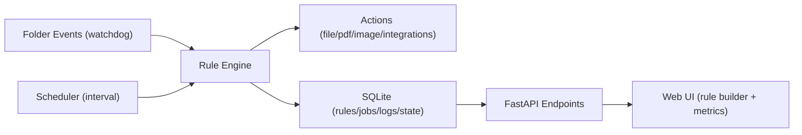

# FlowForge Local

[](./LICENSE)


FlowForge Local is a local-first workflow automation platform for operations-heavy teams and solo professionals.
It watches folders, applies rule-based processing, and logs every job for auditability without sending files to the cloud.

This project demonstrates production-relevant skills for business analyst, data science, and AI-adjacent roles:
- translating messy workflow requirements into configurable rule systems
- building reliable data/process pipelines with retries, observability, and safety controls
- designing full-stack products with clear UX and measurable outcomes

## Why It Matters

Manual file handling is expensive: sorting invoices, extracting text, renaming exports, and tracking failures are repetitive and error-prone.
FlowForge Local reduces this operational overhead with structured automation and transparent execution logs.

## Core Capabilities

- Local-first automation with file watcher + scheduler
- Rule conditions: filename filters, extension allow-lists, size constraints, weekday/hour windows, dedupe checks
- Actions: copy, move, timestamp rename, summarize text, extract PDF text, merge PDFs, image convert/compress
- Reliability controls: retry/backoff, quarantine-on-failure, dry-run previews, undo for destructive actions
- Integrations: outbound webhook notifications and CSV run logs
- Observability: metrics dashboard, per-job logs, execution history
- Portability: import/export rules as JSON
- Templates: prebuilt rule blueprints for fast onboarding

## Architecture



## Tech Stack

- Backend: FastAPI, SQLite, watchdog
- Data/Document processing: pypdf, macOS `sips`
- Frontend: HTML/CSS/Vanilla JS
- Runtime: Python virtualenv

## Quick Start

```bash
cd /Users/kyleparker/Documents/project\ 3
python3 -m venv .venv
source .venv/bin/activate
pip install -r backend/requirements.txt
uvicorn backend.app.main:app --port 8017
```

Open [http://127.0.0.1:8017](http://127.0.0.1:8017).

## API Surface

- `GET /api/templates`
- `GET /api/rules`
- `POST /api/rules`
- `POST /api/rules/import`
- `GET /api/rules/export`
- `PATCH /api/rules/{rule_id}`
- `POST /api/rules/{rule_id}/run`
- `GET /api/jobs`
- `GET /api/jobs/{job_id}/logs`
- `POST /api/jobs/{job_id}/undo`
- `GET /api/metrics`

## Employer-Focused Project Highlights

- Requirements to product: converted a broad workflow-automation idea into a concrete, configurable system.
- Reliability engineering: implemented retries, backoff, quarantine behavior, dry-run, and undo semantics.
- Data-oriented design: structured logs, metrics, rule export/import, and duplicate control mechanisms.
- Systems thinking: coordinated watcher triggers, scheduler polling, API contracts, and UI state.

## Portfolio Assets

- Case study: [docs/CASE_STUDY.md](./docs/CASE_STUDY.md)
- Resume-ready bullets: [docs/RESUME_BULLETS.md](./docs/RESUME_BULLETS.md)

## Project Roadmap

- OAuth-based cloud integrations (Drive/Dropbox/Gmail)
- Queue-backed workers for high-throughput workloads
- Role-based access and multi-user profiles
- Packaged desktop distribution (Tauri/Electron)

## License

MIT. See [LICENSE](./LICENSE).
